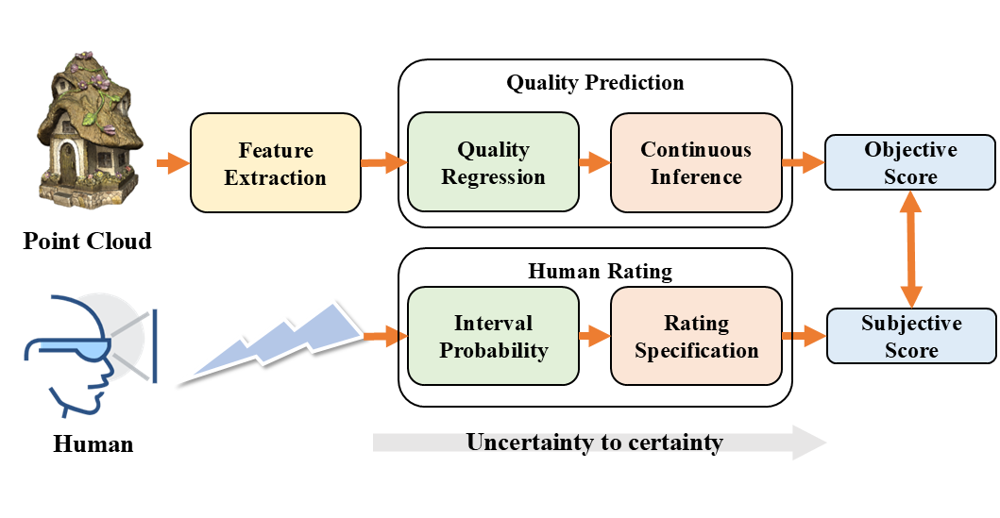
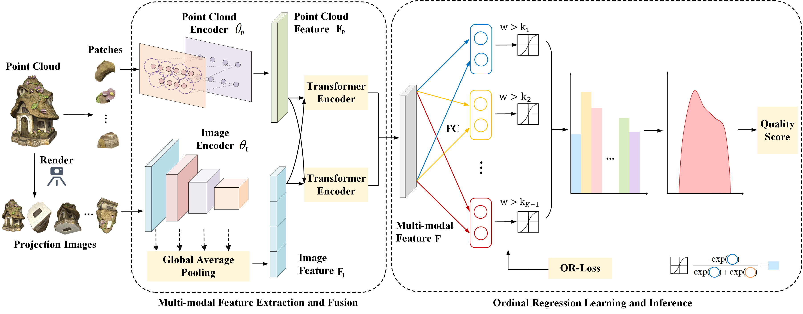
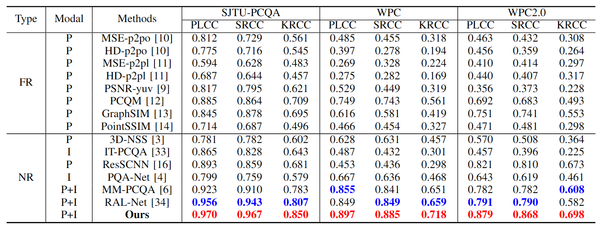

# ORNet: No-reference Point Cloud Quality Assessment in an Ordinal Regression Way 🌟

[](https://opensource.org/licenses/MIT)
[](https://github.com/YovenLi/ORNet)
[](https://arxiv.org)

> 🔍 A novel approach for point cloud quality assessment using ordinal regression

<p align="center">
  
  <br>
  <em>Figure 1: The two-step process of quality prediction mimicking human rating from uncertainty to certainty.</em>
</p>

## 📋 Table of Contents
- [Overview](#-overview)
- [Key Features](#-key-features)
- [Method](#-method)
- [Performance](#-performance)
- [Cross-dataset Evaluation](#-cross-dataset-evaluation)
- [Datasets](#-datasets)
- [Dependencies](#-dependencies)
- [Note](#-note)
- [License](#-license)

## 🔭 Overview

ORNet is a novel no-reference point cloud quality assessment (NR-PCQA) method that reformulates PCQA as an ordinal regression problem. By mimicking the two-step process of subjective human rating of visual quality, which evolves from uncertainty to certainty, our approach achieves superior performance on multiple public benchmarks.

## ✨ Key Features

- **Ordinal Regression Approach**: Formulates PCQA as binary classification sub-problems to better handle the ordered nature of quality scores
- **Multi-modal Fusion**: Combines both 2D projection images and 3D point cloud features
- **OR-Loss**: A novel ordinal loss function specifically designed for PCQA
- **Continuous-based Inference**: Mitigates discretization errors and yields more realistic quality scores
- **Strong Cross-dataset Generalization**: Demonstrated robust performance across different point cloud datasets

## 🛠️ Method

ORNet consists of three main modules:

1. **Data Pre-processing**
   - 2D projection from multiple viewpoints
   - Point cloud patch division using FPS and KNN

2. **Multi-modal Feature Extraction and Fusion**
   - PointNet++ backbone for point cloud feature extraction
   - ResNet50 backbone for image feature extraction
   - Transformer-based cross-modal attention for feature fusion

3. **Ordinal Regression Learning and Inference**
   - Quality regression with binary classification
   - Continuous-based inference for final quality score prediction

<p align="center">
  
  <br>
  <em>Figure 2: The architecture of the proposed ORNet.</em>
</p>

## 📊 Performance

ORNet outperforms state-of-the-art PCQA methods on three widely used datasets:

<div align="center">

| Dataset | PLCC | SRCC | KRCC |
|:-------:|:----:|:----:|:----:|
| SJTU-PCQA | **0.970** | **0.967** | **0.850** |
| WPC | **0.897** | **0.885** | **0.718** |
| WPC2.0 | **0.879** | **0.868** | **0.698** |

</div>

<p align="center">
  
  <br>
  <em>Figure 3: Performance comparison with existing methods.</em>
</p>


## 🔄 Cross-dataset Evaluation

ORNet demonstrates strong generalization ability when trained on one dataset and tested on another:

<div align="center">

| Training→Testing | PLCC | SRCC |
|:----------------:|:----:|:----:|
| WPC→SJTU-PCQA | **0.930** | **0.907** |
| SJTU-PCQA→WPC | **0.537** | **0.430** |

</div>

## 💾 Datasets

We evaluate our method on three widely-used point cloud quality assessment datasets:
- **SJTU-PCQA**: 378 distorted point clouds from 9 references
- **WPC**: 740 distorted point clouds from 20 references
- **WPC2.0**: 400 distorted point clouds from 16 references

## 📦 Dependencies

```bash
torch>=1.7.0
torchvision>=0.8.0
numpy>=1.19.2
scipy>=1.6.0
open3d
```

## 📝 Note

This repository currently contains only the README. Code will be made available after the paper's publication.

## 📜 License

This project is licensed under the MIT License - see the LICENSE file for details.

